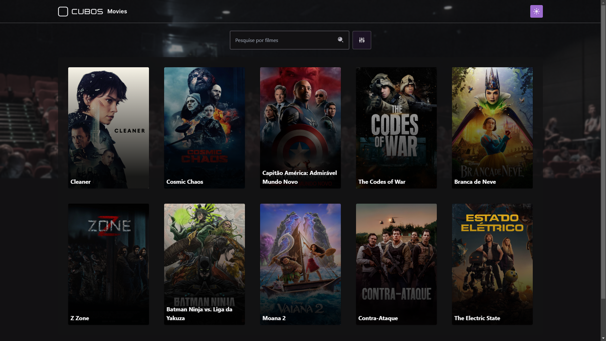
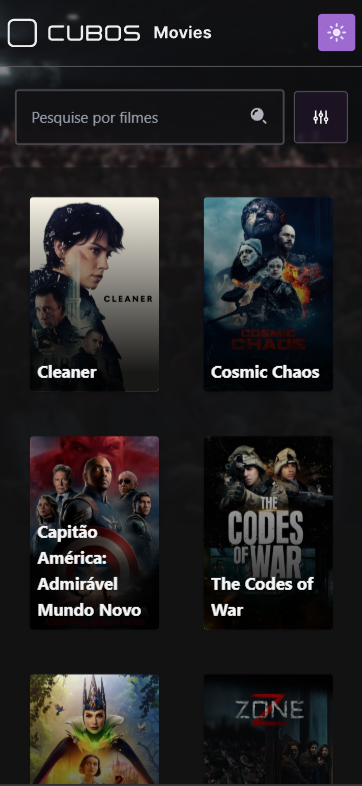
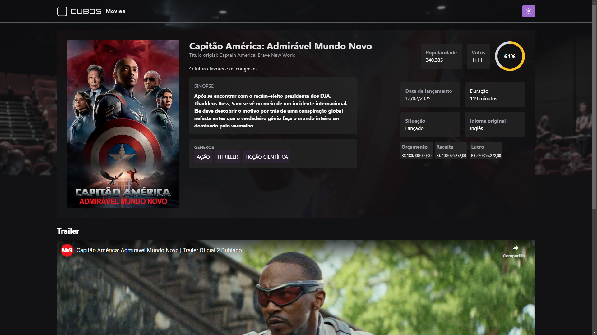
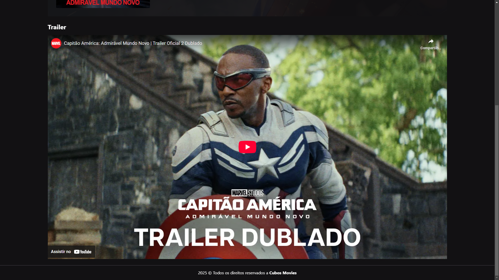
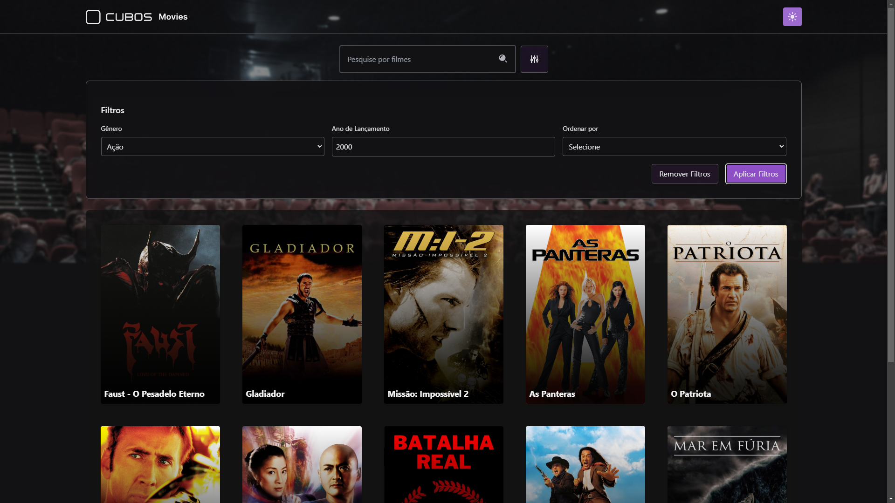
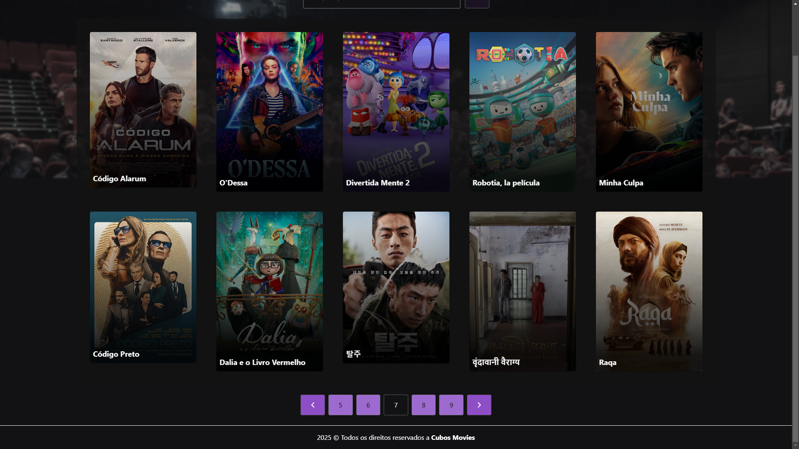

# CUBOS Movies

É um aplicativo web responsivo que consome a API do TMDB (The Movie Database). O aplicativo permite os usuários pesquisar por filmes e visualizar detalhes sobre cada filme, com uma experiência funcional e intuitiva.

## Funcionalidades

- **Pesquisa de Filmes:** Busca por título utilizando a API do TMDB
- **Detalhes Completos:** Visualização de informações detalhadas dos filmes:
  - Popularidade
  - Sinopse
  - Gêneros
  - Data de lançamento, duranção, situação e idioma origial
  - Orçamento, receita e lucro
  - Trailer oficial
- **Design Responsivo:** Adaptação perfeita para mobile e desktop
- **Sistema de Temas:** Alternância entre modo claro e escuro
- **Filtros Avançados:**
  - Ordenação por popularidade/nota
  - Filtragem por gênero
  - Filtragem por ano de lançamento

## Instalação

1. Clone o repositório:

```bash
git clone https://github.com/FellipeMiguel/teste-tecnico-cubos.git
```

2. Clone o repositório:

```bash
npm install
```

3. Inicie o servidor de desenvolvimento:

```bash
npm run dev
```

## Uso

### Navegação Básica

1. **Página Inicial** (`/`):

   - **Pesquisar Filmes:**  
     Digite o nome do filme na barra de pesquisa no topo da página.
   - **Usar Filtros:**  
     Clique no ícone de filtro para:
   - Selecionar gênero(s)
   - Definir ano de lançamento
   - Ordenar por popularidade/nota
   - **Acessar Detalhes:**  
     Clique em qualquer card de filme para ver informações detalhadas.

2. **Página de Detalhes** (`/movie/:id`):
   - **Assistir Trailer:**  
     Se disponível, o trailer oficial será exibido no topo da página.
   - **Informações Financeiras:**  
     Verifique orçamento, receita e lucro na seção dedicada.
   - **Dados Técnicos:**  
     Consulte duração, data de lançamento e status de produção.
   - **Voltar à Home:**  
     Clique no logo ou use o botão "Voltar" do navegador.

## Capturas de Tela

### Página Inicial

| **Página inicial (Desktop)**                                                          | **Página inicial (Mobile)**                                                                                |
| ------------------------------------------------------------------------------------- | ---------------------------------------------------------------------------------------------------------- |
|  |  |
| _Barra de pesquisa, filtros e grid de filmes_                                         | _Layout adaptativo_                                                                                        |

### Página de Detalhes

| **Visão Geral (Desktop)**                                                        | **Trailer (Desktop)**                                                                        |
| -------------------------------------------------------------------------------- | -------------------------------------------------------------------------------------------- |
|  |  |
| _Informações técnicas e financeiras_                                             | _Trailer do filme em tela cheia_                                                             |

### Funcionalidades Chave

| **Filtros Ativos**                                                                 | **Paginação**                                                                     |
| ---------------------------------------------------------------------------------- | --------------------------------------------------------------------------------- |
|  |  |
| _Filtragem por gênero e ano_                                                       | _Navegação entre páginas de resultados_                                           |

## Deploy

A aplicação está hospedada e pode ser acessada através do link:  
**🔗 [https://cubos-movies.vercel.app](https://cubos-movie-seven.vercel.app/)**

[](https://cubos-movies.vercel.app)

> _Nota: Para uso local ou desenvolvimento, siga as instruções de instalação acima._
